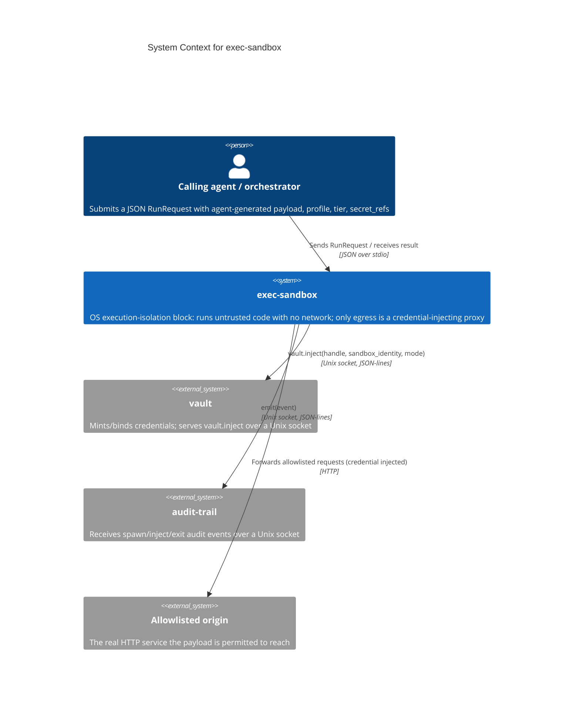
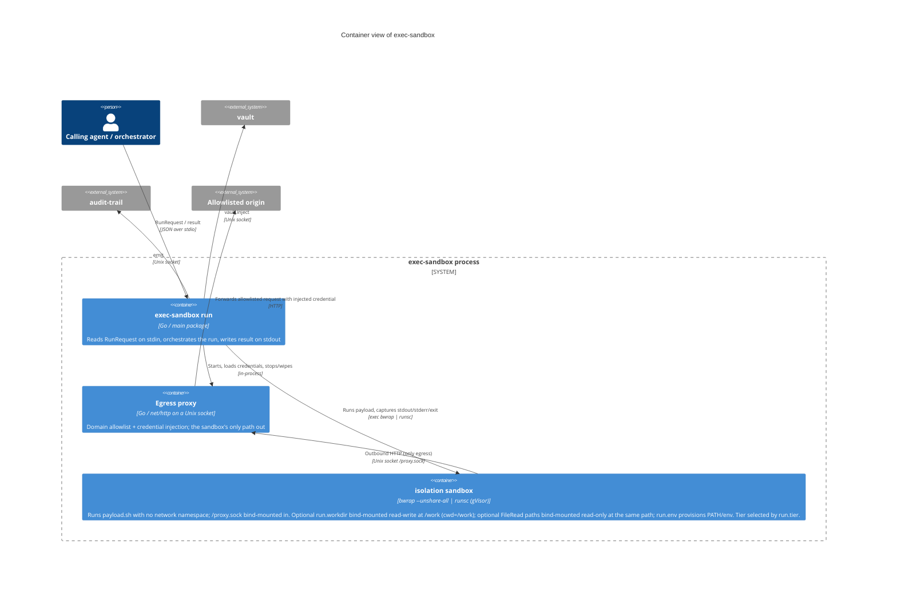
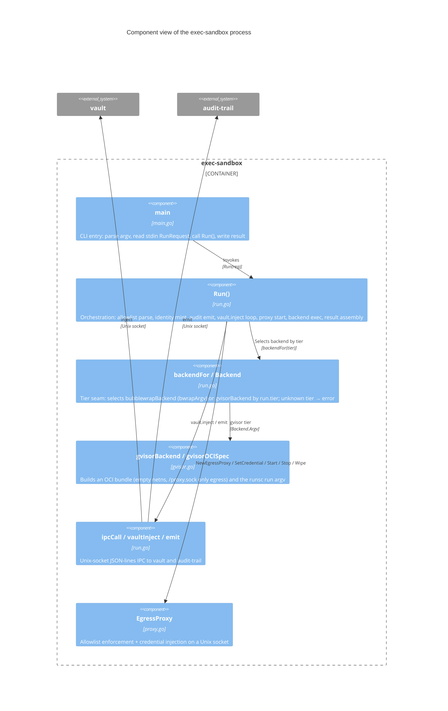

# Architecture Diagrams

**Project:** exec-sandbox
**Last updated:** 2026-06-19 (ADR-008: per-host HTTP-verb allowlist enforcement in the egress proxy)

C4-structured Mermaid diagrams covering the system at progressively detailed levels (Context → Container → Component), plus the runtime sequence flow that shows how those pieces collaborate. See [overview.md](overview.md) for prose context, [decisions/](decisions/) for the ADRs referenced here, and [`../spec/architecture.md`](../spec/architecture.md) for the structured element catalog these diagrams render.

These diagrams are part of the **authoritative spec** for this project. Code changes that contradict a diagram either invalidate the change or invalidate the diagram; one must be updated to match the other in the same commit.

GitHub and most IDE markdown previewers render Mermaid natively — no build step required.

> **Scaling rule.** exec-sandbox is a single deployable binary, so the Container view is small (one process plus the host-side proxy it runs and the two external blocks it talks to). The Component view is where the load-bearing structure lives.

---

## 1. System Context — who uses it and what it touches



---

## 2. Containers — runnable units inside the system



---

## 3. Components — modules inside the exec-sandbox process



**Key contracts**
- The sandbox has **no network namespace** regardless of tier (`bwrap --unshare-all`, or the gVisor OCI spec's empty `network` namespace + `runsc --network=none`); `/proxy.sock` is the only egress. (ADR-001 D3, ADR-002)
- exec-sandbox owns the network boundary + proxy + allowlist; vault owns credential injection. The proxy-mode credential **never** enters the sandbox. (ADR-001 D4/D5)
- The `tier` seam (`backendFor`) selects the isolation backend; bubblewrap (Tier 1) and gVisor (Tier 2) are wired, Firecracker (Tier 3) returns `tier not implemented`. (ADR-001 D7, ADR-002)

---

## 4. Primary runtime flow — `Run()` end-to-end

```mermaid
sequenceDiagram
    autonumber
    participant Agent as Calling agent
    participant Run as exec-sandbox Run()
    participant Vault as vault
    participant Proxy as Egress proxy
    participant Box as isolation sandbox (bwrap | runsc)
    participant Audit as audit-trail

    Agent->>Run: RunRequest {payload, profile, tier, secret_refs} on stdin
    Run->>Run: parse NetConnect allowlist + per-host verb sets; mint sandbox_identity
    Run->>Audit: emit spawn {actor, action:spawn, target:sandbox_id, decision:allow}
    loop for each secret_ref handle
        Run->>Vault: vault.inject(handle, sandbox_identity, mode)
        alt proxy-mode success
            Vault-->>Run: {credential, binding:{host,header,scheme}}
            Run->>Proxy: SetCredential(host, cred)  %% never enters sandbox
        else failure / deny
            Vault-->>Run: error
            Run->>Audit: emit inject_failed {decision:deny}
        end
    end
    Run->>Run: validateWorkdir(run.workdir) + validateFileReads(FileRead paths) (bad path → error, no run)
    Run->>Proxy: Start(proxy.sock)
    Run->>Run: backendFor(tier) → bubblewrap | gvisor (unknown → error)
    Run->>Box: exec backend (bwrap --unshare-all, or runsc over an OCI bundle; payload.sh + /proxy.sock bind-mounted, no network; run.workdir → /work rw cwd=/work; FileRead paths → ro mounts; run.env → PATH/env)
    Box->>Proxy: outbound HTTP via /proxy.sock (only egress)
    Proxy->>Proxy: host allowlist check, then per-host verb check (ADR 008); inject credential
    Proxy-->>Box: forwarded response (or 403 blocked-by-allowlist / 403 blocked-by-method / 502 no-route)
    Box-->>Run: stdout, stderr, exit_code
    Run->>Audit: emit exit {action:exit, exit_code, duration_ms}
    Run->>Proxy: Stop() + Wipe()
    Run-->>Agent: {stdout, stderr, exit_code, sandbox_status} on stdout
```

---

## Adding more diagrams

Add additional numbered sections (5., 6., …) for any of:

- **Per-flow sequence diagrams** — the gVisor Tier-2 dispatch path reuses the flow in section 4 with the backend exec step covering both `bwrap` and `runsc` (every other edge is identical); split it into its own section only if the two paths diverge beyond the exec step.
- **State machines** — if a subsystem grows explicit states with transitions.
- **Deployment topology** — `C4Deployment` if the runtime layout becomes non-obvious.

One concept per diagram.

---

## Maintaining these diagrams

- **Trigger to update:** any time a new actor, container, or component appears; a boundary moves; an external dependency is added or removed; an ADR changes a diagrammed flow. Keep [`../spec/architecture.md`](../spec/architecture.md) in sync — the catalog and these diagrams describe the same elements.
- **Edit existing over adding new.** Duplicates rot independently. If a diagram has grown unwieldy, split it by extracting a self-contained subflow into its own numbered section.
- **Note ADRs that don't change diagrams.** When an ADR introduces a refactor that preserves the diagrammed runtime shape, add a one-line note here saying so.
- **Update the date at the top** when you change anything substantive.
